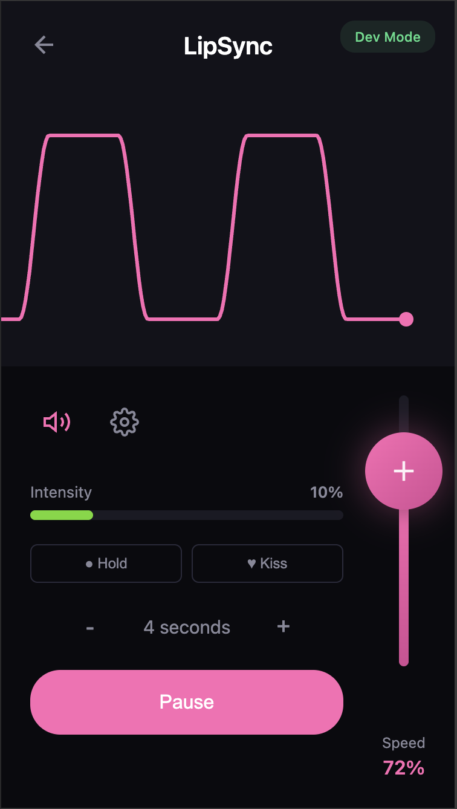

# LipSync

A rhythm-guided training system with haptic feedback. Turn oral service into a game they *really* don't want to lose.

Your sub follows a wave pattern on their phone while wearing an RF shock collar. Fall out of rhythm? They get a reminder. You control the pace.

Everything runs on a single ESP32 - no cloud, no apps to install, completely self-contained.



## Features

- **Visual guidance** - Smooth wave pattern shows the target rhythm
- **Audio cues** - High/low beeps signal direction changes
- **Adjustable pace** - Slide to control speed in real-time
- **Escalating feedback** - Starts gentle, increases with repeated mistakes
- **Shock collar integration** - Works with cheap 433MHz RF collars
- **Hold modes** - Special modes for deepthroat and kiss/lick
- **Motion tracking** - Optional IMU shows their actual movement vs target
- **No internet required** - Works completely offline
- **Mobile-first UI** - Designed for phones and tablets

## How It Works

```
┌──────────────────┐         ┌──────────────────────────────────┐
│   Phone/Tablet   │         │         ESP32 Device             │
│    (Browser)     │◄───────►│                                  │
│                  │  WiFi   │  - Web server (serves React app) │
│  Opens:          │         │  - WebSocket (real-time comms)   │
│  lipsync.local   │         │  - RF transmitter (collar ctrl)  │
│                  │         │  - MPU6050 IMU (motion tracking) │
└──────────────────┘         └──────────────────────────────────┘
```

The ESP32 creates its own WiFi network. Connect your phone, open the browser, and you're ready to play.

## Bill of Materials

| Component | Description | Qty | Approx. Price | Notes | Link |
|-----------|-------------|-----|---------------|-------|------|
| ESP32 Dev Board | ESP-WROOM-32 with CH340C USB | 1 | $6 | Any ESP32 devkit works | [aliexpress](https://www.aliexpress.com/item/1005005495948290.html?spm=a2g0o.order_list.order_list_main.15.35a9180218PAU0) |
| 433MHz RF Transmitter | FS1000A or similar | 1 | $3 | For collar control | [aliexpress](https://www.aliexpress.com/item/32820610184.html?spm=a2g0o.order_list.order_list_main.68.3cf818022Tuhjv) |
| RF Shock Collar | CaiXianlin protocol (common on Amazon/AliExpress) | 1 | $25 | The cheap ones with 3 channels | [aliexpress](https://www.aliexpress.com/item/1005005133046985.html?spm=a2g0o.order_list.order_list_main.73.7a7c1802LxhIXn) |
| MPU6050 IMU | 6-axis accelerometer/gyro | 1 | $2 | Optional - for motion tracking | [aliexpress](https://www.aliexpress.com/item/1005009668682906.html?spm=a2g0o.order_list.order_list_main.5.31e21802mOT362) |
| Jumper Wires | Female-to-female | ~10 | $2 | For connections |
| USB Cable | Micro-USB or USB-C (depends on board) | 1 | - | Data cable, not charge-only |
| Enclosure | 3D printed or project box | 1 | - | Optional - STL files included |
| 18650 Enclosure | | 1 | $3 | Anything that will provide 5v via USB | [aliexpress](https://www.aliexpress.com/item/4000225705264.html?spm=a2g0o.productlist.main.3.6eb47cdcI3rKrQ&algo_pvid=3bceff15-865b-4fc9-a1e7-80fd209c7bd5&algo_exp_id=3bceff15-865b-4fc9-a1e7-80fd209c7bd5-2&pdp_ext_f=%7B%22order%22%3A%22557%22%2C%22spu_best_type%22%3A%22order%22%2C%22eval%22%3A%221%22%2C%22fromPage%22%3A%22search%22%7D&pdp_npi=6%40dis%21GBP%211.69%211.69%21%21%212.20%212.20%21%402103890117664361618361181edefc%2110000000887930324%21sea%21UK%21765854333%21X%211%210%21n_tag%3A-29919%3Bd%3Aa37805a3%3Bm03_new_user%3A-29895&curPageLogUid=bnPlmO818cNE&utparam-url=scene%3Asearch%7Cquery_from%3A%7Cx_object_id%3A4000225705264%7C_p_origin_prod%3A) |
| 18650 Battery | | 1 | $4 | | [aliexpress](https://www.aliexpress.com/item/1005010557364599.html?spm=a2g0o.productlist.main.3.57d1184fWd38nA&algo_pvid=5e19cdcd-bc21-48f4-8853-18cf01c0cc41&algo_exp_id=5e19cdcd-bc21-48f4-8853-18cf01c0cc41-2&pdp_ext_f=%7B%22order%22%3A%227%22%2C%22eval%22%3A%221%22%2C%22fromPage%22%3A%22search%22%7D&pdp_npi=6%40dis%21GBP%2122.02%213.17%21%21%21201.47%2129.04%21%402103919917664363228704335e4ed8%2112000052806891711%21sea%21UK%21765854333%21X%211%210%21n_tag%3A-29919%3Bd%3Aa37805a3%3Bm03_new_user%3A-29895%3BpisId%3A5000000197087145&curPageLogUid=75kd0oxtRwHv&utparam-url=scene%3Asearch%7Cquery_from%3A%7Cx_object_id%3A1005010557364599%7C_p_origin_prod%3A)

**Total cost: ~$45** (depending on what you already have)

### Where to Buy

- **ESP32**: Amazon, AliExpress, or electronics suppliers like Adafruit/SparkFun
- **RF Transmitter**: Search "433MHz transmitter module FS1000A"
- **Shock Collar**: Search "dog training collar 433MHz" - look for ones with vibrate/beep/shock modes
- **MPU6050**: Search "MPU6050 GY-521 module"

## Wiring

```
ESP32 Pin    Component
─────────    ─────────
GPIO 15  →   RF Transmitter DATA
GPIO 21  →   MPU6050 SDA (optional)
GPIO 22  →   MPU6050 SCL (optional)
3.3V     →   RF Transmitter VCC, MPU6050 VCC
GND      →   RF Transmitter GND, MPU6050 GND
```

**Note**: Some RF transmitters work better with 5V. If range is poor, try connecting VCC to the 5V pin instead.

## Quick Start

### 1. Flash the Firmware

```bash
# Install PlatformIO
brew install platformio   # macOS
# or: pip install platformio

# Clone and build
git clone https://github.com/yourusername/lipsync.git
cd lipsync/client
npm install
npm run build
cp -r dist/* ../firmware/data/

cd ../firmware
pio run -t upload -e esp32dev      # Upload firmware (hold BOOT button)
pio run -t uploadfs -e esp32dev    # Upload web files
```

### 2. Connect and Play

1. Power on the ESP32
2. Connect to the "LipSync" WiFi network (password: `lipsync123`)
3. Open `http://lipsync.local` in your browser (or `http://192.168.4.1`)
4. Tap "Play" to begin!

### 3. Pairing the collar

Collars can be put into pairing mode by pressing the power button for ~2 seconds. There will be a beep, and the light will flash continuously.
To pair, send a "beep" signal from the app (open the settings cog and click the "Beep" button)

## Usage

### Main Controls

- **Speed Slider** (right side) - Drag up/down to control pace
- **Start/Pause** - Begin or pause the session
- **Hold/Kiss** - Quick buttons for hold modes

### Settings (gear icon)

- **Punishment Mode**: Beep, Vibrate, or Shock
- **Max Intensity**: Limit for shock strength
- **Increasing Intensity**: Start low, escalate with mistakes

### How Feedback Works

1. **Grace period** after speed changes - time to adjust
2. **First mistake** at a given speed - warning vibration
3. **Repeated mistakes** - shock at current intensity
4. **Each punishment** - intensity increases (if enabled)
5. **Speed change** - resets warning, gives grace period

## Development

### Local Web Development

```bash
cd client
npm run dev    # Starts at http://localhost:5173
```

### Firmware Development

```bash
cd firmware
pio run                           # Build
pio run -t upload                 # Upload
pio device monitor -b 115200      # Serial monitor
```

### Serial Commands

Connect at 115200 baud for debugging:
- `v` - Test vibrate
- `b` - Test beep
- `s` - Show status
- `h` - Help

## Project Structure

```
lipsync/
├── client/                 # React web app (Vite + TypeScript)
│   ├── src/
│   │   ├── components/     # UI components
│   │   ├── context/        # State management
│   │   ├── hooks/          # useWebSocket, useAudio
│   │   └── styles/         # CSS
│   └── package.json
├── firmware/               # ESP32 firmware (PlatformIO)
│   ├── src/main.cpp        # Main firmware
│   ├── include/            # Headers (config, RF, IMU)
│   ├── data/               # Built web files (LittleFS)
│   └── platformio.ini
├── enclosure/              # 3D printable enclosure STLs
└── screenshots/
```

## Troubleshooting

### Can't connect to WiFi
- Make sure you're connecting to "LipSync" network
- Password is `lipsync123`
- Try `http://192.168.4.1` if `.local` doesn't work

### Collar not responding
- Check RF transmitter wiring (DATA to GPIO 15)
- Try 5V instead of 3.3V for the transmitter
- Use serial monitor to confirm signals are being sent

### Upload fails
- Hold the BOOT button when upload starts
- Try a different USB cable (must be data, not charge-only)
- Close any serial monitors first

### Web app not loading
- Make sure filesystem was uploaded: `pio run -t uploadfs`
- Check serial output for errors

## Safety

This project involves shock collars. Please:
- **Always have a safeword** and a way to immediately stop
- **Test intensity on yourself first** before using on a partner
- **Start at low intensity** and increase gradually
- **Never use on anyone with a heart condition** or pacemaker
- **Remove if any unusual reaction occurs**
- This is for **consensual adult play only**

## Contributing

PRs welcome! Some ideas for improvements:
- [ ] Bluetooth collar support
- [ ] Pattern presets (slow build, random, etc.)
- [ ] Multi-sub support
- [ ] Session statistics/scoring
- [ ] OTA firmware updates

## License

MIT License - do whatever you want with it.

## Acknowledgments

- Built with [PlatformIO](https://platformio.org/), [React](https://react.dev/), [Vite](https://vitejs.dev/)
- RF protocol reverse-engineered from CaiXianlin collar remotes
- Massive props to Openshock for their work with the RF collars
- Thanks to some random guy off reddit for the idea
- Inspired by too many late nights and questionable life choices
